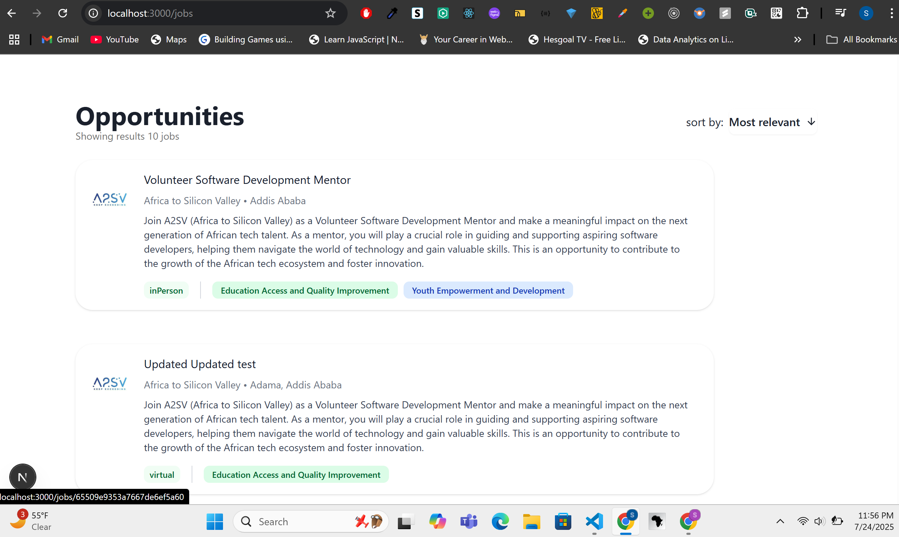
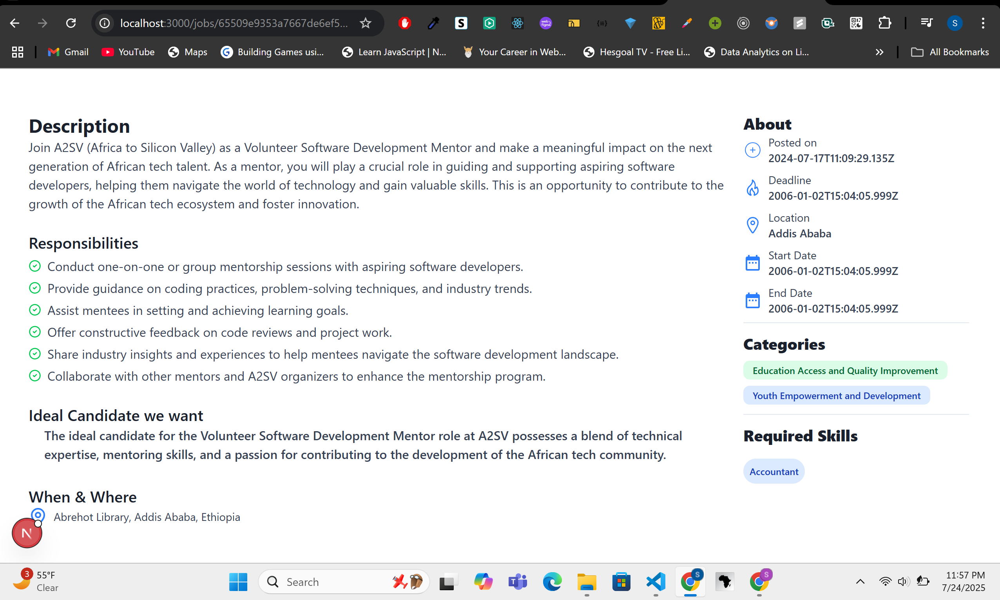
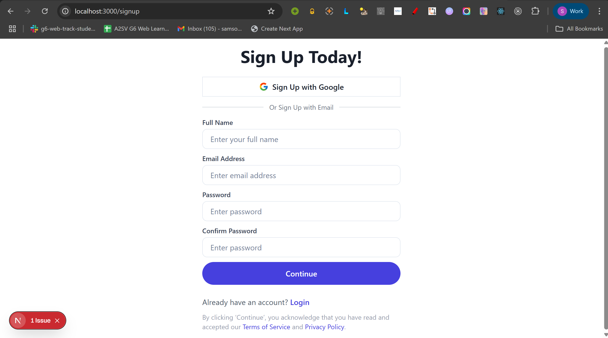
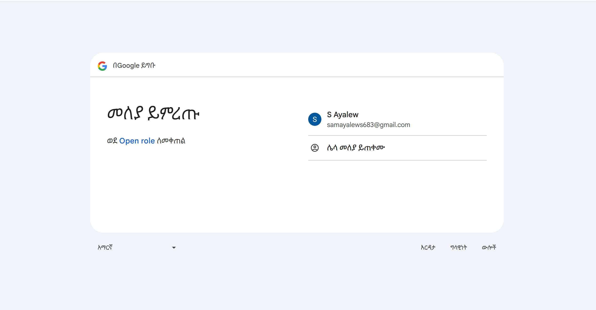
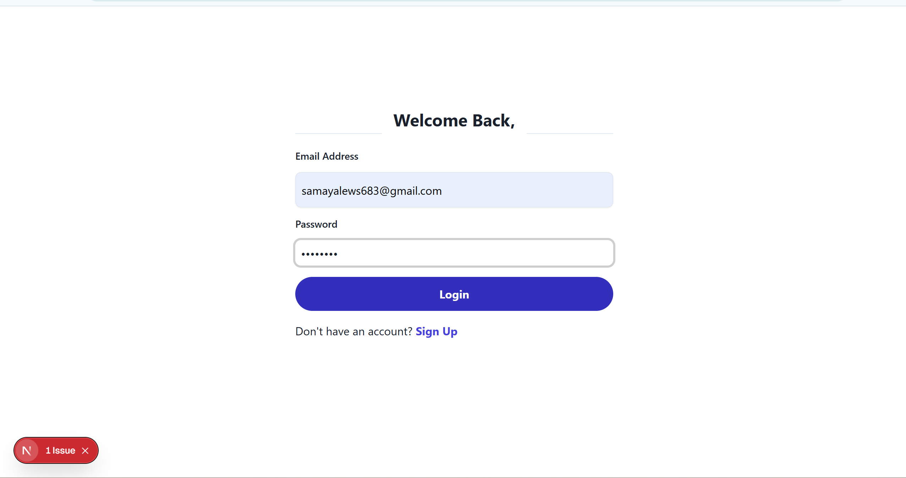
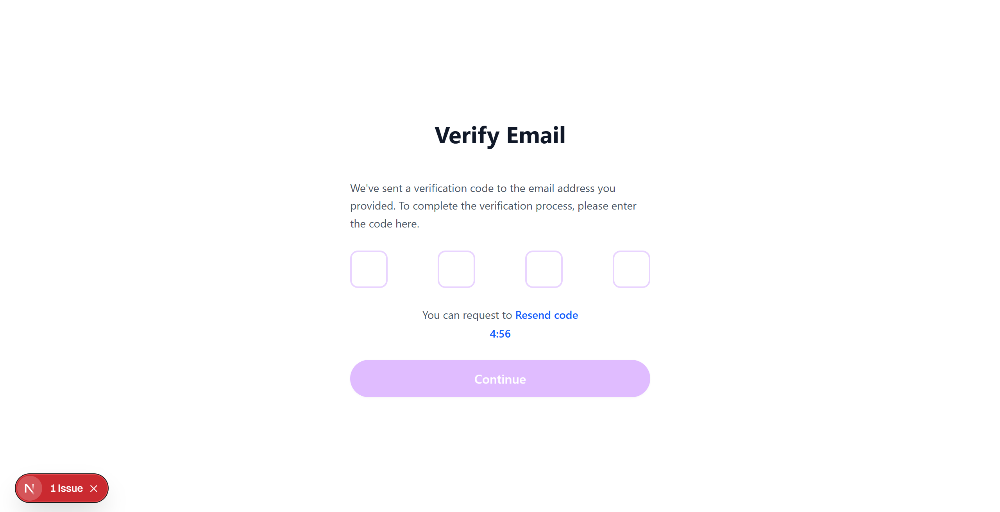

## Getting Started

1. **Clone the repository:**

   ```bash
   git clone https://github.com/samson-16/Open_role.git
   cd Open_role
   ```

2. **Install dependencies:**

   ```bash
   npm install
   # or
   yarn install
   # or
   pnpm install
   # or
   bun install
   ```

3. **Run the development server:**
   ```bash
   npm run dev
   # or
   yarn dev
   # or
   pnpm dev
   # or
   bun dev
   ```

## Features

- Fetches job list and job details from the API endpoints:
 
- Uses TypeScript types for API data consistency
- Responsive UI with category color coding
- Modern UI components (shadcn/ui)

## Screenshots

**Job List Page**


**Job Description Page (Detail Page)**



 Authentication (Signup & Login)
This project supports user authentication using NextAuth.js, with two sign-in methods:

1. 🔒 Custom Email/Password (Credentials Provider)
➕ Signup
Users can register using a form that collects:

Full Name

Email Address

Password

Upon submission, an OTP (One-Time Password) is sent to the user's email for verification.

Once the OTP is verified, the user is automatically logged in and provided:

accessToken

refreshToken

user data

The session is managed using NextAuth.js with signIn("credentials").

🔐 Login
Users can log in via the email/password form.

On success, the server returns the accessToken and refreshToken, and the user is signed in via signIn("credentials").

2. 🟢 Google OAuth
Users can sign in with their Google account using the "Continue with Google" button.

This method is powered by NextAuth’s Google provider.

A session is automatically created and persisted.

📦 Session Management
The app uses NextAuth.js for consistent session handling across both login methods.

Authenticated API requests use the bearer token (accessToken) to interact with protected endpoints.

sign up page

sign in with google provider

login page

verification page



